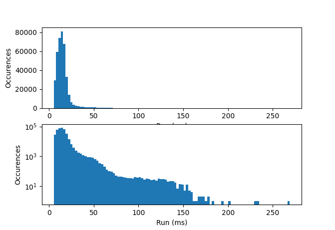
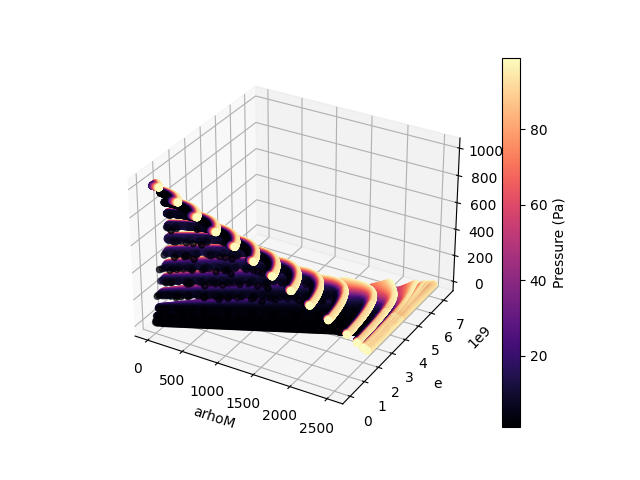
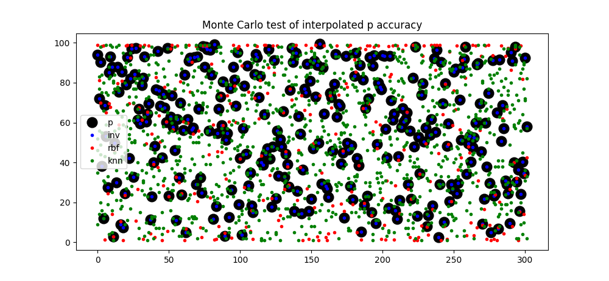

### Steam tools

An implementation of rootfinding for mixtures involving water described by steam tables (via pyXSteam) is included in `p_steam_root1d`. The algorithm is a two-level 1D rootfinder using Brent's method, with conserved variables as inputs. The outer level solves for the pressure that satisfies the saturation condition. The saturation condition is not satisfied a priori at the initial bracketing values of pressure, for which the volume fractions are computed using the partial density and the specific volume specified by the thermodynamic state. The specific volume is computed as a function of pressure (magma) or a function of pressure and enthalpy (water). The water's specific enthalpy is not explicitly known; the inner level of the two-level rootfinder solves for the specific enthalpy consistent with the total energy density.

Additional details: Brent's method brackets the root, like in bisection. As such, initial guesses are not necessary. Newton's method requires analytic derivatives (e.g. heat capacity of water). While the heat capacity is available via pyXSteam, the computation is expensive and leads to the algorithm taking longer than for Brent's method.

For calculations of conserved variables given pressure and water specific enthalpy, use an `InverseTabulation` below. This direction of calculation is typically the opposite (inverse) of what is needed during a simulation, in which we know the conserved variables and need the pressure to compute the flux. The inverse direction is the easier one, and can be used to compute reference solutions to verify algorithms that compute the forward direction.

For calculations of pressure and other primitive variables from the conserved variables, use a `SteamCalc` object described below.

The file `inv_steam_tabulation.py` provides the inverse steam tabulation class:

`InverseTabulation(params, is_required_regular_grid=False)`: object containing a map from a set of points in (p, h, arhoW) space to conserved variable space (arhoM, e, arhoW). Here h refers to the water's specific enthalpy. The set of points in (p, h, arhoW) space is non-uniform, and is denser under the critical pressure, near the liquid phase transition. Argument `params` can be a `physics.multiphasevpT` object, but in principle only needs to contain attribute `Liquid` containing the physics parameters for the liquid magma phase. If `is_required_regular_grid` is set to `True`, the resulting object will also compute the map from a set of uniformly distributed points in (p, h, arhoW) space. Usage example below.

```
# Construct inverse tabulation
itab = InverseTabulation(physics)
# Extract the nonuniform sampling of (p, h) of water
p, h = itab.rd_tab["p"], itab.rd_tab["h"]
# Compute mapping to (arhoM, e) given value of arhoW
arhoM, e = itab.get_arhoM_e_on_rd_sampling(arhoW)
# Optionally, to get volume fraction of water
itab.get_mix_volfracWater_on_rd_sampling(self, arhoW)
```

To use the regular grid, replace `rd_tab` with `reg_tab`.

The file `p_steam_root1d.py` exposes the following class:

`SteamCalc(itab, Liquid, method="brent")`: steam calculator object. Initialize by providing an inverse steam tabulation (`physics.multiphasevpT.inv_steam_tabulation.InverseTabulation`, and the `Liquid` object found in a `physics.multiphasevpT` object. Optionally, provide the method (`brent` or `bisect-newton`; `brent` is strongly recommended). 

### Plotting tools

Plotting tools are found in `.\src\processing\mdtools.py`.

`mdtools` contains tools for plotting multidomain objects. The following functions are provided for convenient plotting. Probably the useful one is `viz`.

`viz(solver, plot_qty="Pressure", levels=None, clims=None)`: quick visualization of solver. String `plot_qty` is the name of the quantity defined in multiphasevpT.py (search term `AdditionalVariables`; these are the variable names like `Pressure`). The names of the conserved variables also work: these are `pDensityA`, `pDensityWv`, `pDensityM`, `XMomentum` (and `YMomentum`), `Energy`, `pDensityWt`, and `pDensityC`. This works for 1D and 2D.

`downsample(solver, plot_qty:str="Pressure")`: returns `(x, var_plot)`, a downsample of the finite element solution suitable for plotting. Downsampling is effective for obtaining a coarse mesh of points for quickly plotting arbitrary solutions. Variable x are points where the solution (`var_plot`) is evaluated.

`custom_plot_2D(x, var_plot, solver, levels=None, clims=None)`: a quick 2D plot using the given data `(x, var_plot)`. This function allows arbitrary data to be plotted rapidly. The default Quail visualizers are more detailed and may take longer. If there is no specific mesh to be plotted, one can use `viz` instead to automatically obtain a quick mesh.

`plot_mean(x, q, clims)`: the fastest 2D plot (plots only the mean value of each element). This can be used if `viz` is taking too long, or there's just TOO much detail.

`plot_mean1D(x, q, clims, xscale=1.0, xshift=0.0)`: plots 1D data as 2D rectangles. The xscale and xshift modify the width of the rectangles and where the domain ends. This can be used to make plots containing 2D and 1D portions.

`generate_anim(atm_names, conduit_names, outfilename, num_frames, plot_qty, filter=lambda x, x0:x, initial=1, stride=1, is_high_detail=False)`: generates an animation using ffmpeg. ffmpeg must be installed, and the path must be provided in the environment. List of file names (excluding the number of the file) in the working directory are specified as `atm_names` and `conduit_names`. The output file name for the animation is `outfilename`. Provide also the number of frames to render (`num_frames`), and the name of the quantity (`plot_qty`). Optionally, a filter can be provided (mapping x -> f(x); some useful ones are log10(abs(x))). 

### Exact solution

`util.py/RiemannSolution`: contains fast construction of the solution to the Riemann problem, consisting of an expansion, contact (a.k.a. material interface), and shock.

### Experimental steam features

We evaluate the performance of SteamCalc in this section. The data used to generate the scatter plots are available (`water_test_range.npy` contains an array of values `[p, T, rho, wall_clock]` computed by SteamCalc, while `water_test_range_ref.npy` contains the values `[p, arhoM, e, arhoW]` computed by InverseTabulation; the latter values can be treated as the reference solution). The data was generated as in `p_steam_test.py`.

The performance of SteamCalc, verified against the inverse map given by InverseTabulation.reg_tab, is shown below as a histogram. Typical computations are acceptable at `<30 ms`, but in some cases can take longer due to the internal computation method of pyXSteam in the high-temperature region (region 3) of parameter space.



The feasible space of the parameter space is rather narrow:



Due to the stiffness of the magma, gradients of pressure with respect to conserved variables can be large.

One idea to mitigate the cost of computing pressure is to precompute and interpolate. Unfortunately, due to the sensitivity of pressure to conserved variables, such a strategy is inaccurate without an extremely detailed 3D interpolation, or a clever transformation of the variables before interpolation. The figure below compares the pressure (vertical axis) for a number of randomly sampled states (see `p_steam_test.py`). The reference solution is shown as large black dots; superimposed is the SteamCalc output (labaled inv). These two agree well. A radial basis function interpolation (labaled rbf) is shown as red dots; these are not sufficiently accurate. The 4 nearest neighbors to the sample, in conserved variable space, are shown as green dots. The large spread for a given random sample suggest large jumps in pressure between points that are close by in conserved variable space.


